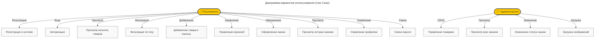

```mermaid
---
title: Диаграмма вариантов использования (Use Case)
---
graph TD
    %% Актеры
    User([👤 Пользователь])
    Admin([👨‍💼 Администратор])
    
    %% Пользовательские сценарии
    User -->|Регистрация| A[Регистрация в системе]
    User -->|Вход| B[Авторизация]
    User -->|Просмотр| C[Просмотр каталога товаров]
    User -->|Фильтрация| D[Фильтрация по типу]
    User -->|Добавление| E[Добавление товара в корзину]
    User -->|Управление| F[Управление корзиной]
    User -->|Оформление| G[Оформление заказа]
    User -->|Просмотр| H[Просмотр истории заказов]
    User -->|Управление| I[Управление профилем]
    User -->|Смена| J[Смена пароля]
    
    %% Администраторские сценарии
    Admin -->|CRUD| K[Управление товарами]
    Admin -->|Просмотр| L[Просмотр всех заказов]
    Admin -->|Изменение| M[Изменение статуса заказа]
    Admin -->|Загрузка| N[Загрузка изображений]
    
    %% Стилизация
    classDef actor fill:#ffcc00,stroke:#333,stroke-width:2px
    classDef usecase fill:#f9f9f9,stroke:#666,stroke-width:1px
    
    class User,Admin actor
    class A,B,C,D,E,F,G,H,I,J,K,L,M,N usecase
```
